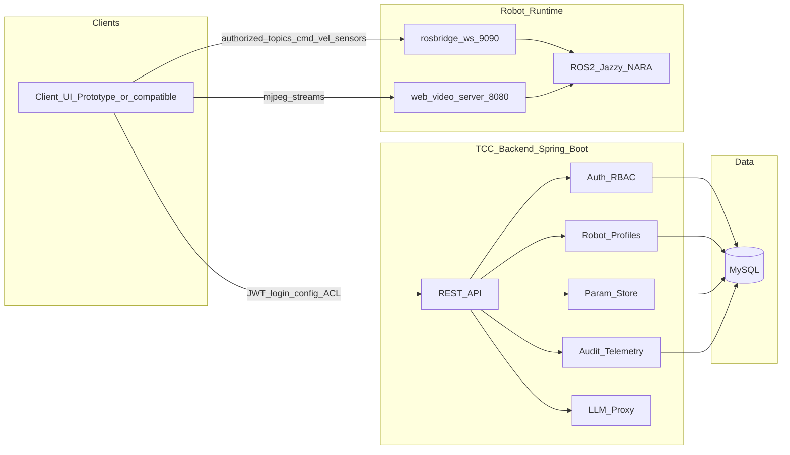
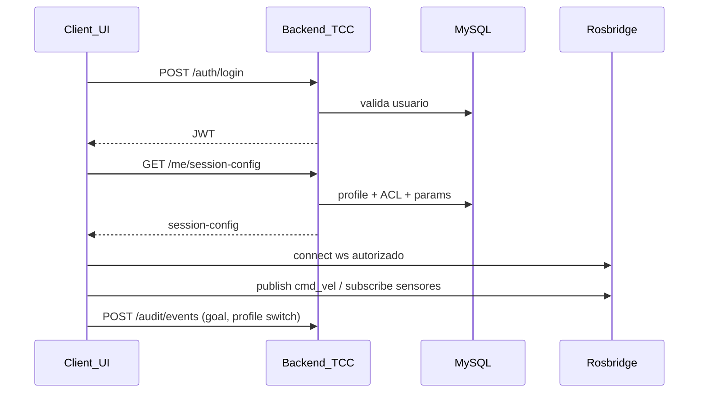

# Visão geral do sistema

**Versão:** 0.2  
**Status:** Vigente (docs-first)  
**ADRs relacionadas:** ADR-006 (stack), ADR-002, ADR-003, ADR-004, ADR-005  

---

## 1. Objetivo

Descrever a arquitetura-alvo do **Bifrost**: um backend de **governo** (ponte governada) para sistemas autônomos, com estudo de caso NARA (`noblenara`), sem mediar cada mensagem ROS de tempo real e **sem depender** de uma IHM de terceiros.

Ver também: [`bifrost-nome-e-metafora.md`](bifrost-nome-e-metafora.md).

---

## 2. Diagrama de contexto

---

## 3. Limites de responsabilidade

| Componente | Faz | Não faz (MVP) |
|------------|-----|----------------|
| Backend TCC | Auth, RBAC, profiles, params, session-config, auditoria, LLM proxy | Encaminhar cada Twist; UI completa; Nav2 |
| Client UI | UI, teleop local, subscribe ROS, câmeras/mapa | Fonte da verdade de papéis/tópicos |
| `noblenara` / ROS | Simulação/hardware, tópicos, navegação | Persistência de usuários do produto |
| MySQL | Estado de produto | Grafo TF / bags ROS |

---

## 4. Fluxo de sessão (híbrido)

---

## 5. Ambientes

| Ambiente | Descrição |
|----------|-----------|
| `sim` | `nara-sim` + Gazebo + bridgelaunch |
| `physical` | Jetson / cadeira real (`nara-main`) — profile distinto |

Robot Profiles carregam o ambiente e as URLs de bridge/vídeo adequadas.

---

## 6. Evolução

1. Docs-first (agora)  
2. Skeleton `apps/backend` + migrations MySQL  
3. Auth + session-config  
4. Profiles + params  
5. Protótipo leve de client UI (testes)  
6. Auditoria/telemetria e LLM proxy  
7. Fase 2: biometria (ADR-005)
