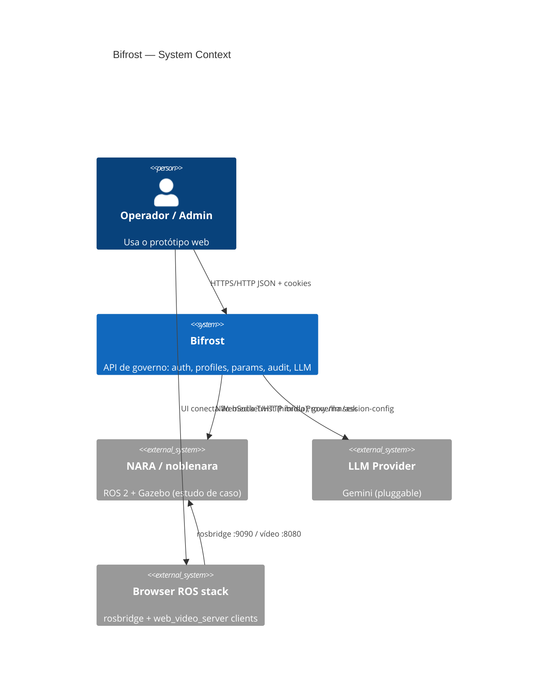
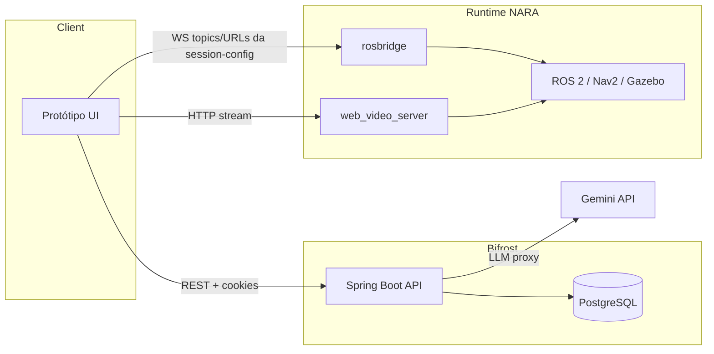

# C4 — Contexto e containers (Bifrost)

## Context

```mermaid
C4Context
  title Bifrost — System Context
  Person(operator, "Operador / Admin", "Usa o protótipo web")
  System(bifrost, "Bifrost", "API de governo: auth, profiles, params, audit, LLM")
  System_Ext(nara, "NARA / noblenara", "ROS 2 + Gazebo (estudo de caso)")
  System_Ext(gemini, "LLM Provider", "Gemini (pluggable)")
  System_Ext(browser_ros, "Browser ROS stack", "rosbridge + web_video_server clients")

  Rel(operator, bifrost, "HTTPS/HTTP JSON + cookies")
  Rel(operator, browser_ros, "UI conecta WebSocket/HTTP mídia")
  Rel(browser_ros, nara, "rosbridge :9090 / vídeo :8080")
  Rel(bifrost, gemini, "Proxy /llm/ask")
  Rel(bifrost, nara, "Não media Twist (híbrido); governa session-config")
```

> Se o renderer não suportar `C4Context`, use o diagrama de containers abaixo (flowchart).

## Containers

```mermaid
flowchart LR
  subgraph Client
    UI[Protótipo UI]
  end
  subgraph Bifrost
    API[Spring Boot API]
    PG[(PostgreSQL)]
  end
  subgraph Runtime_NARA[Runtime NARA]
    RB[rosbridge]
    VV[web_video_server]
    ROS[ROS 2 / Nav2 / Gazebo]
  end
  LLM[Gemini API]

  UI -->|REST + cookies| API
  API --> PG
  UI -->|WS topics/URLs da session-config| RB
  UI -->|HTTP stream| VV
  RB --> ROS
  VV --> ROS
  API -->|LLM proxy| LLM
```
