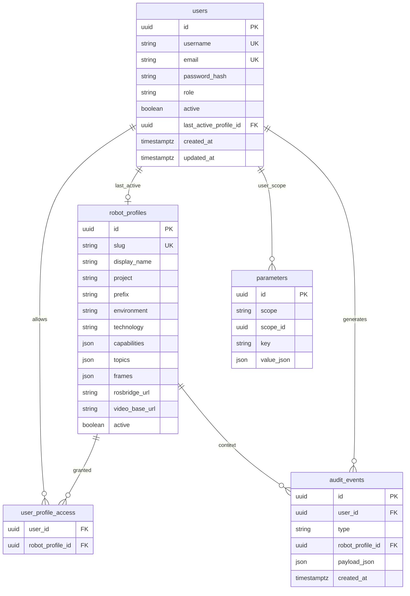

# ER — PostgreSQL (MVP)

Modelo lógico alinhado à functional spec + ADRs 007–011.

Notas:

- `parameters.scope`: `global` | `user` no MVP (`scope_id` null se global)
- Refresh tokens (se persistidos) podem ganhar tabela própria na implementação — fora deste ER mínimo
